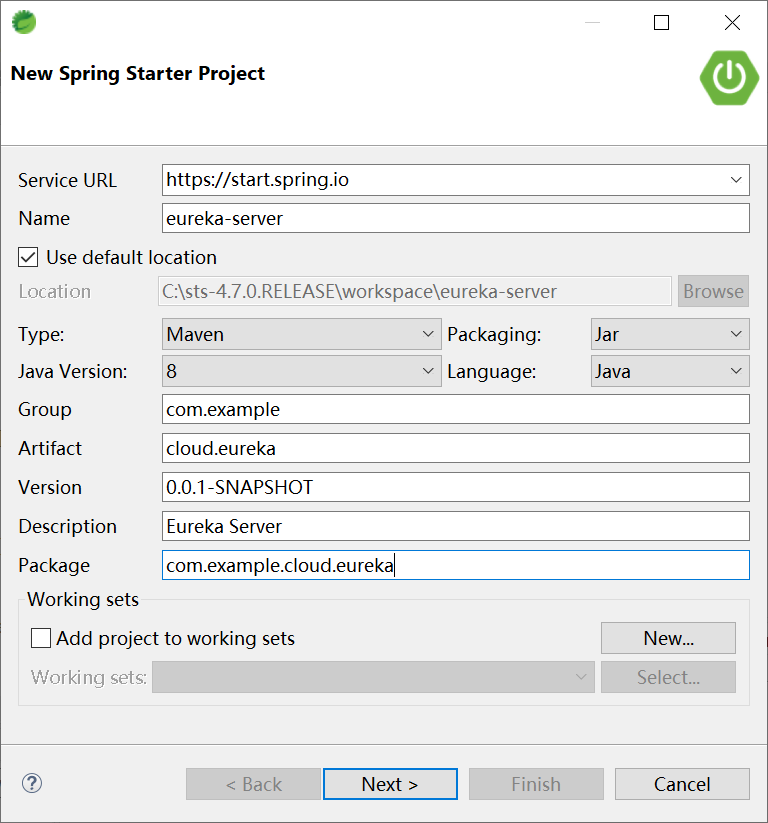
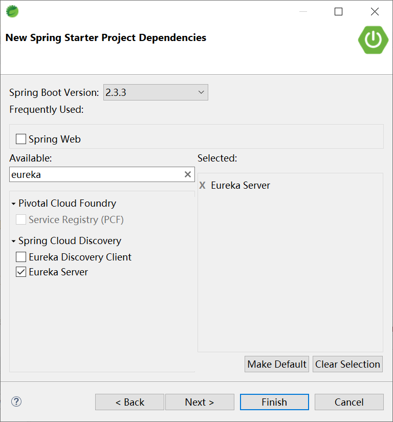
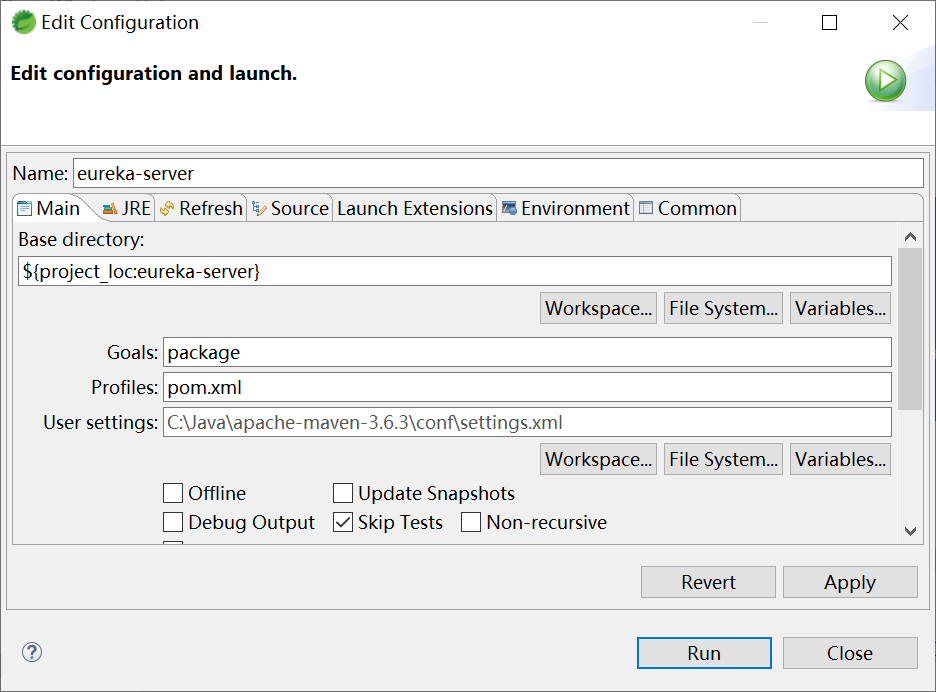
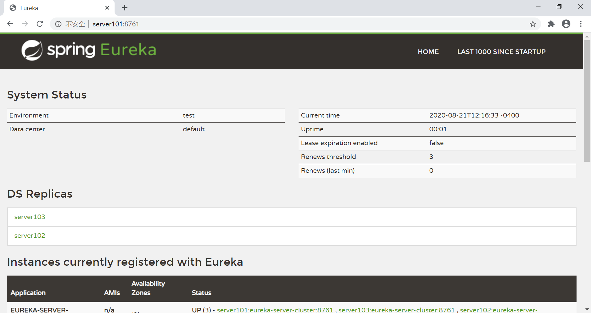

## 2.3 编写 Eureka Server








```yaml
spring:
  application:
    name: eureka-server-cluster
---
spring:
  profiles: server101
server:
  port: 8761
eureka:
  instance:
    hostname: server101
  client:
    service-url:
      defaultZone: http://server102:8761/eureka,http://server103:8761/eureka
---
spring:
  profiles: server102
server:
  port: 8761
eureka:
  instance:
    hostname: server102
  client:
    service-url:
      defaultZone: http://server101:8761/eureka,http://server103:8761/eureka
---
spring:
  profiles: server103
server:
  port: 8761
eureka:
  instance:
    hostname: server103
  client:
    service-url:
      defaultZone: http://server101:8761/eureka,http://server102:8761/eureka      
```


EurekaServerApplication 启动类：

```java
@EnableEurekaServer
@SpringBootApplication
public class EurekaServerApplication {

	public static void main(String[] args) {
		SpringApplication.run(EurekaServerApplication.class, args);
	}

}
```





上传`C:\sts-4.7.0.RELEASE\workspace\eureka-server\target\cloud.eureka-0.0.1-SNAPSHOT.jar`到服务器（server101、server102和server103）上，分别执行如下启动脚本：

```bash
nohup java -jar cloud.eureka-0.0.1-SNAPSHOT.jar --spring.profiles.active=server101 >log.txt &
nohup java -jar cloud.eureka-0.0.1-SNAPSHOT.jar --spring.profiles.active=server102 >log.txt &
nohup java -jar cloud.eureka-0.0.1-SNAPSHOT.jar --spring.profiles.active=server103 >log.txt &
```


