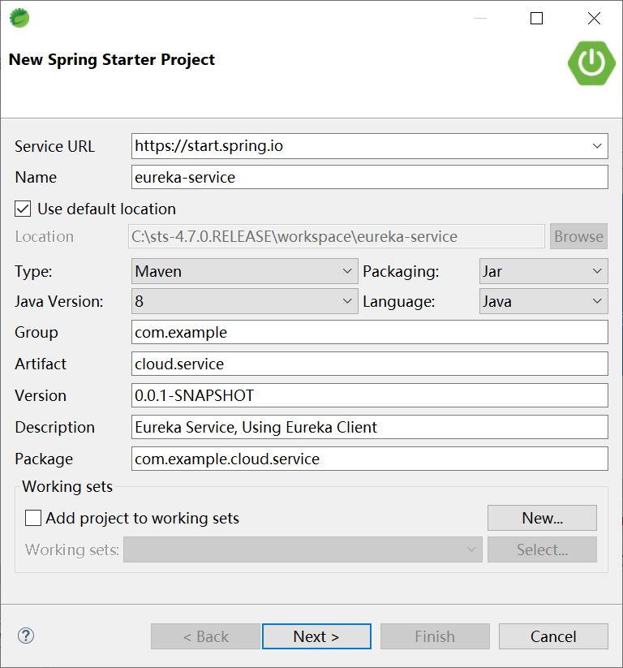
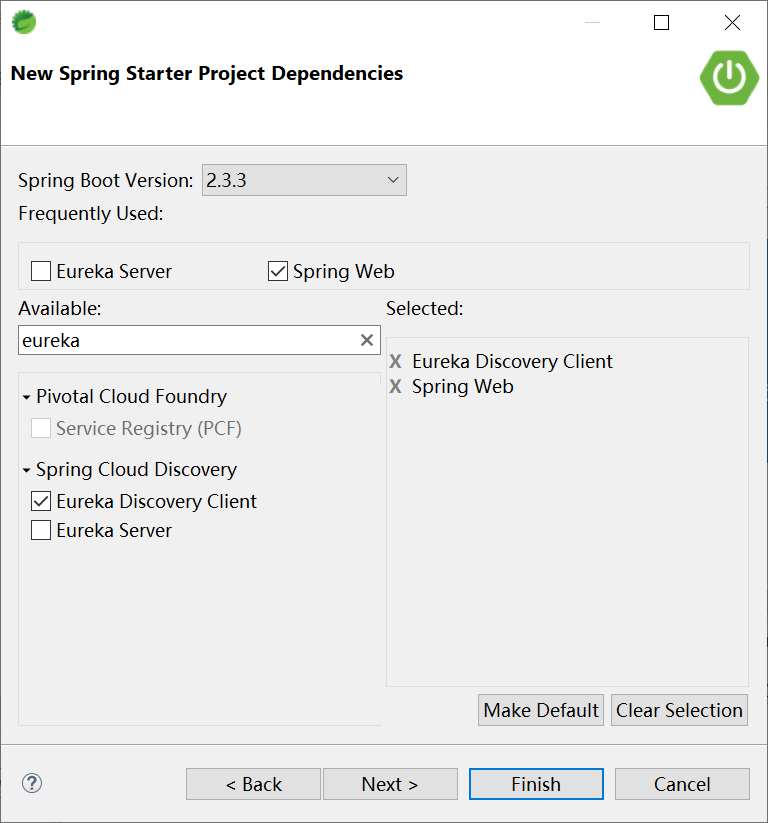
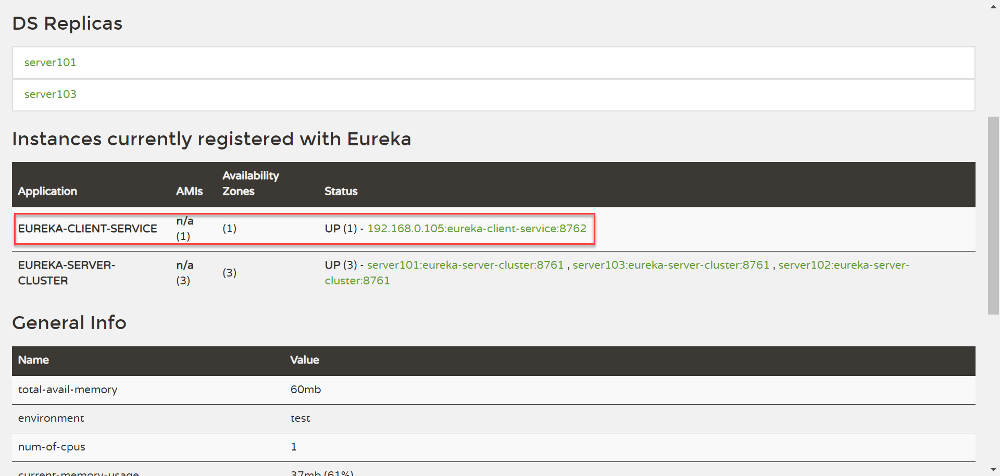
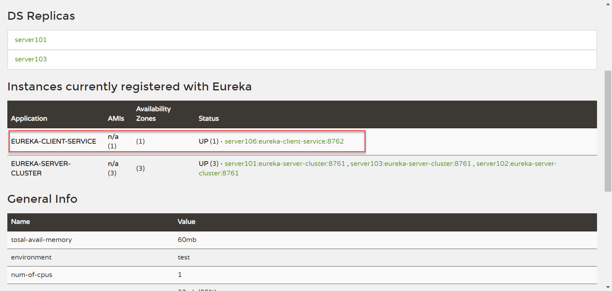
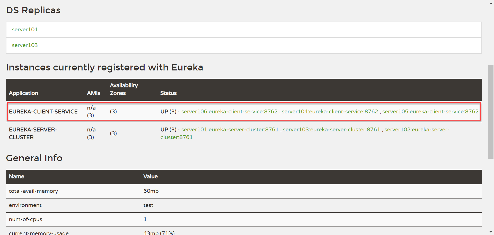

## 2.4 编写 Eureka Client


创建项目eureka-service




选择依赖项




application.yml

```yaml
eureka:
  client:
    service-url:
      defaultZone: http://server101:8761/eureka,http://server102:8761/eureka,http://server103:8761/eureka
server:
  port: 8762
spring:
  application:
    name: eureka-client-service
```


EurekaServiceApplication

```java
@EnableEurekaClient
@SpringBootApplication
public class EurekaServiceApplication {

	public static void main(String[] args) {
		SpringApplication.run(EurekaServiceApplication.class, args);
	}

}
```

HelloController

```java
@RestController
public class HelloController {

	@Value("${server.port}")
	String port;

	@RequestMapping("/hello")
	public String hello(String name) {
		return "Hello, " + name + ". FROM " + port;
	}

}
```





将项目打包（maven package）后，上传到 server106，然后执行如下命令，启动服务

```bash
nohup java -jar cloud.service-0.0.1-SNAPSHOT.jar >service-log.txt &
```

打开eureka[管理界面](http://server102:8761/)，可以看到server106上的服务已经注册到eureka中了。



当然，访问[http://server106:8762/hello?name=Kevin](http://server106:8762/hello?name=Kevin)一样会正确的返回服务结果。

我们继续在server104和server105上部署这个服务并启动，在eureka的管理界面中，可以看到`EUREKA-CLIENT-SERVICE`这个服务，在服务注册中心（eureka）中是由3台服务器（server104、server105和server106）提供服务的。



后续，我们会通过Spring Boot提供的负载均衡器来访问`EUREKA-CLIENT-SERVICE`这个服务，而不管服务究竟部署在哪台服务器上。