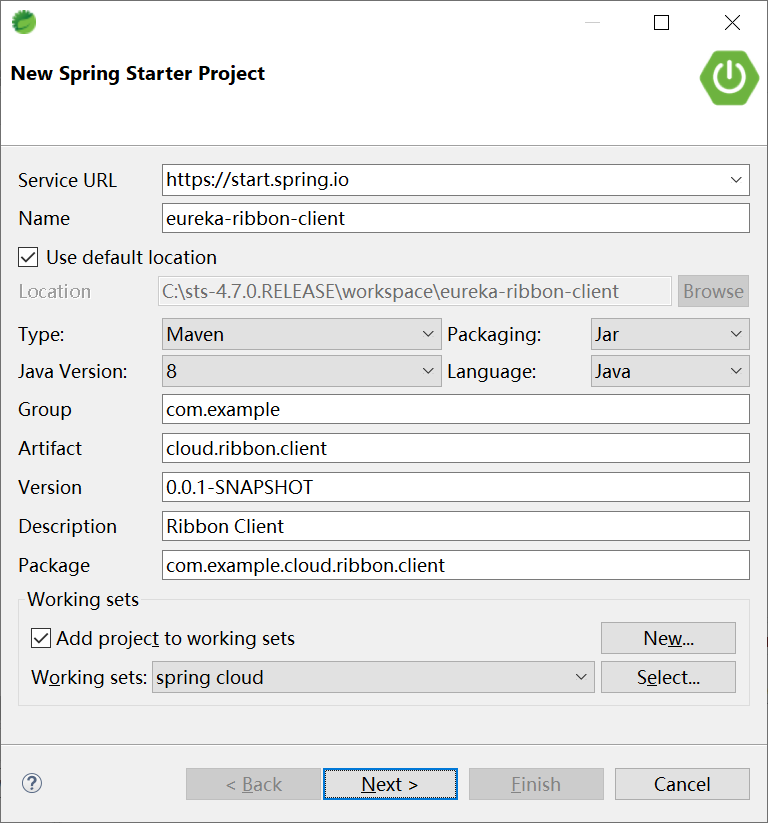
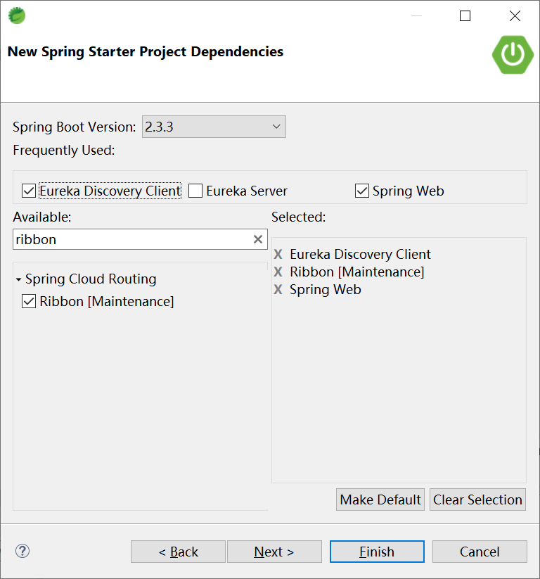
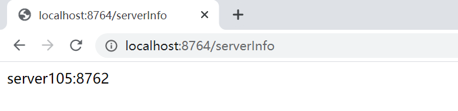

## 3.2 RestTemplate 结合 Ribbon

创建 Ribbon 客户端项目 eureka-ribbon-client，来调用注册到 Eureka 上的服务



选择起步依赖




启动类 EurekaRibbonClientApplication

```java
@EnableEurekaClient
@SpringBootApplication
public class EurekaRibbonClientApplication {

	public static void main(String[] args) {
		SpringApplication.run(EurekaRibbonClientApplication.class, args);
	}

}
```

配置类 RibbonConfig

```java
@Configuration
public class RibbonConfig {
	@Bean
	@LoadBalanced
	RestTemplate restTemplate() {
		return new RestTemplate();
	}

}
```

服务类 RibbonHelloService

```java
@Service
public class RibbonHelloService {
	@Autowired
	RestTemplate restTemplate;
	
	public String hello(String name) {
		return restTemplate.getForObject("http://EUREKA-CLIENT-SERVICE/hello?name=" + name, String.class);
	}

}
```

控制器类 RibbonClientController

```java
@RestController
public class RibbonClientController {
	@Autowired
	private RibbonHelloService ribbonHelloService;
	@Autowired
	private LoadBalancerClient loadBalancer;

	@RequestMapping("/hello")
	public String hello(String name) {
		return ribbonHelloService.hello(name);
	}

	@RequestMapping("/serverInfo")
	public String getServerInfo() {
		ServiceInstance serviceInstance = loadBalancer.choose("EUREKA-CLIENT-SERVICE");
		return serviceInstance.getHost() + ":" + serviceInstance.getPort();
	}

}
```

启用应用，访问本机的[http://localhost:8764/hello?name=Kevin](http://localhost:8764/hello?name=Kevin)，通过服务器注册中心（Eureka），以负载均衡的方式获取`EUREKA-CLIENT-SERVICE`服务。


访问 serverInfo 方法，可以看到服务是以负载均衡的方式提供的。



刷新


再次刷新


可以通过浏览器验证，服务是以负载均衡的方式从 3 台服务器（server104~106）上依次提供的。

这个例子，我们使用了：

1. 服务注册中心 Eureka，并将其以高可用集群的方式部署到 3 台机器（server101~103）上；
2. 通过 Eureka Client 的方式，将服务 `EUREKA-CLIENT-SERVICE` 注册到服务注册中心上，这个服务同样部署在 3 台机器（server104~106）上；
3. 本地 host 机上运行本小节创建的项目 eureka-ribbon-client，通过负责均衡的 RestTemplate 访问 `EUREKA-CLIENT-SERVICE` 服务；
4. 通过 ServiceInstance 验证了提供服务所在的服务器地址（或domain name）和端口。

本小节这个例子虽然简单，但是却已经具备了分布式微服务架构的高可用性和水平扩展性。