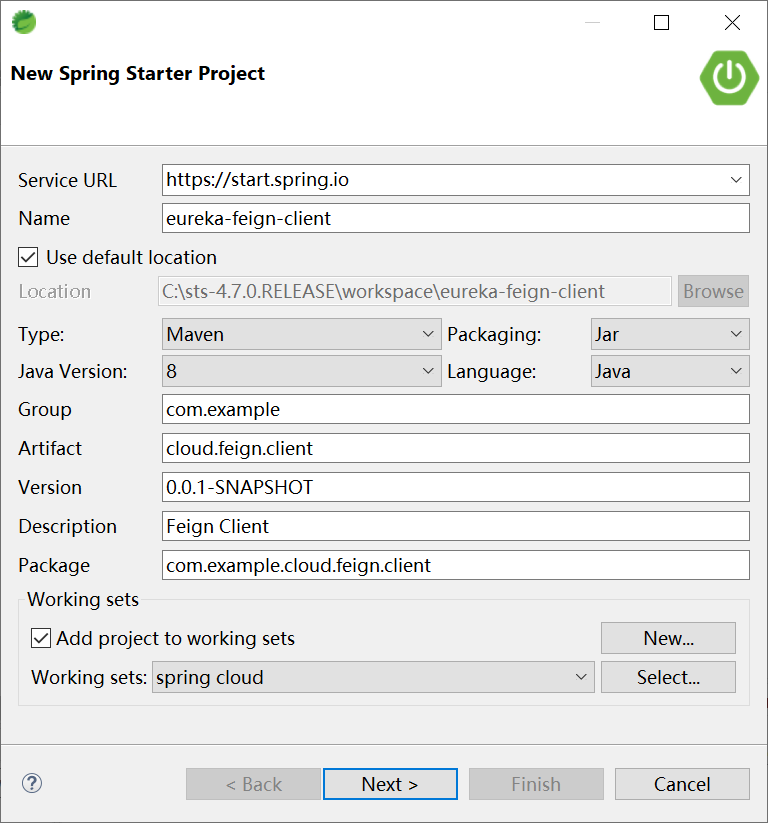
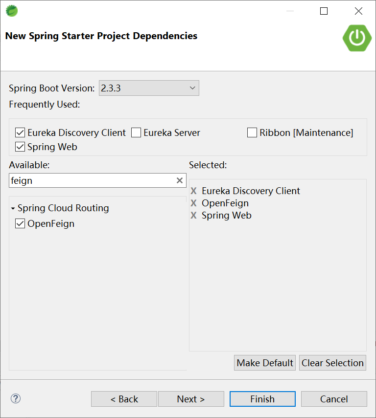
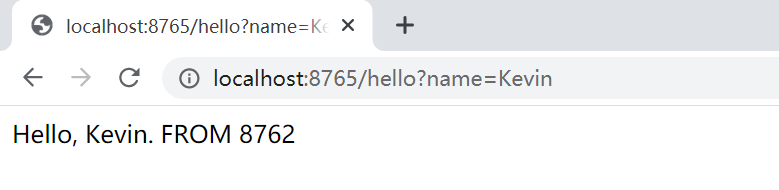

## 4.2 使用 Feign 调用服务


创建 eureka-feign-client 项目



选择起步依赖




配置参数

```yaml
eureka:
  client:
    service-url:
      defaultZone: http://server101:8761/eureka,http://server102:8761/eureka,http://server103:8761/eureka
server:
  port: 8765
spring:
  application:
    name: eureka-feign-client
```


启动类

```java
@EnableEurekaClient
@EnableFeignClients
@SpringBootApplication
public class EurekaFeignClientApplication {

	public static void main(String[] args) {
		SpringApplication.run(EurekaFeignClientApplication.class, args);
	}

}
```

配置类

```java
@Configuration
public class FeignConfig {
	@Bean
	public Retryer feignRetyer() {
		return new Retryer.Default(100,  TimeUnit.SECONDS.toMillis(1), 5);
	}

}
```

FeignClient 接口

```java
@FeignClient(value = "EUREKA-CLIENT-SERVICE", configuration = FeignConfig.class)
public interface EurekaFeignClient {
	@RequestMapping("/hello")
	String hello(@RequestParam(value = "name") String name);

}
```

服务类

```java
@Service
public class HelloService {
	@Autowired
	EurekaFeignClient client;
	
	public String hello(String name) {
		return client.hello(name);
	}

}
```

控制器类

```
@RestController
public class FeignClientController {
	@Autowired
	HelloService helloService;
	
	@RequestMapping("/hello")
	public String hello(String name) {
		return helloService.hello(name);
	}

}
```


访问[http://localhost:8765/hello?name=Kevin](http://localhost:8765/hello?name=Kevin)

