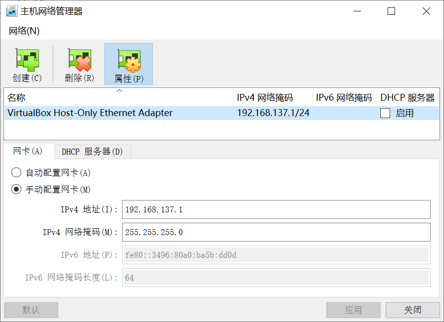
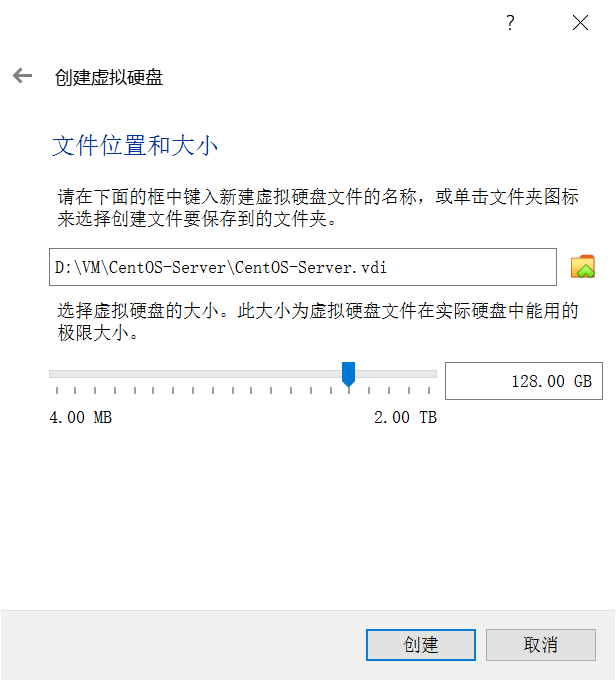
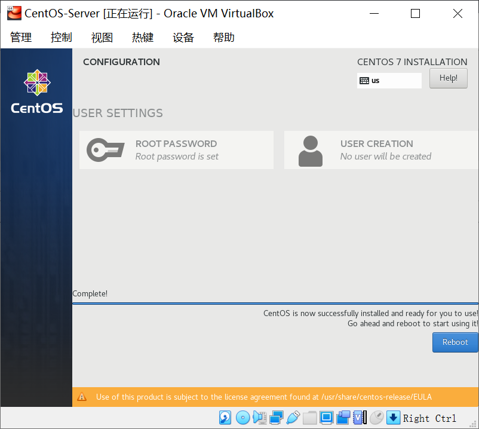

## 附录1.1 搭建 VirtualBox 环境

为了集中精力学习 Spring Cloud 开发，同时不引入过多的技术，本教程采用 Oracle VM VirtualBox 虚拟机来搭建运行测试环境。

> 当然，最经济适用的是使用 Docker 容器技术，但是使用 Docker 会引入更多的技术需求。

### 附录1.1.1 安装 VirtualBox 虚拟机 

到官网 [https://download.virtualbox.org/virtualbox/6.1.12/VirtualBox-6.1.12-139181-Win.exe](https://download.virtualbox.org/virtualbox/6.1.12/VirtualBox-6.1.12-139181-Win.exe) 下载虚拟机安装文件，和扩展包 [https://download.virtualbox.org/virtualbox/6.1.12/Oracle_VM_VirtualBox_Extension_Pack-6.1.12.vbox-extpack](https://download.virtualbox.org/virtualbox/6.1.12/Oracle_VM_VirtualBox_Extension_Pack-6.1.12.vbox-extpack)（可支持虚拟机与主机之间的双向拷贝、显卡驱动等）。

双击下载回来的虚拟机安装包 VirtualBox-6.1.12-139181-Win.exe，按照提示安装。

> 如果你的机器上安装了 Docker Desktop，则需要执行命令 `bcdedit /set hypervisorlaunchtype off` 以开启VT 并解决 Hyper-v 冲突。

然后打开 VirtualBox 的全局设定，并添加扩展包 Oracle_VM_VirtualBox_Extension_Pack-6.1.12.vbox-extpack（也可以双击这个文件，自动安装）。

### 附录1.1.2 设置 Host Only 网络

为了固定虚拟机网络 IP 地址，并与宿主（host）机建立稳定的连接，建议使用 VirtualBox 的 Host Only 网络。

我们后续在虚拟机中需要访问网络（例如安装 OpenJDK），这就需要设置 VirtualBox Host-Only Ethernet Adapter 网卡（ VirtualBox 在 Windows 中创建的一个虚拟网卡）使用开发机器的物理上网网卡（本机 Intel(R) Wi-Fi 6 AX201 160MHz 无线网卡）共享网络连接。

选择本机物理无线网卡（或者可以上网的有线网卡），右键“属性”，选择“共享”页签，设置“Internet 连接共享”，选择“VirtualBox Host-Only Network”网络。

这样，当开发机器的网卡连接外网时，VirtualBox 的 Host-Only 网络就可以连接外网了。

打开 Oracle VM VirtualBox 软件，在其菜单“管理-主机网络管理器(H)...”菜单中检查 Host Only 网卡的设置。

> 选择手动配置网卡，其中的主机网络 IP 为 192.168.137.1，网络掩码为：255.255.255.0
>
> 后续虚拟机中的 IP 地址就可以设置为 192.168.137.x，网关和 DNS 设置为主机网络地址 192.168.137.1 即可。
>
> 因为虚拟机需要固定 IP 地址，所以建议不开启 DHCP 服务器。

### 附录1.1.3 安装 Linux 虚拟机

到 CentOS [官网](https://www.centos.org/download/)下载 [https://mirrors.tuna.tsinghua.edu.cn/centos/7.8.2003/isos/x86_64/CentOS-7-x86_64-DVD-2003.iso](https://mirrors.tuna.tsinghua.edu.cn/centos/7.8.2003/isos/x86_64/CentOS-7-x86_64-DVD-2003.iso) 安装镜像文件。

打开 Oracle VM VirtualBox 软件，新建虚拟机，选择红帽 Linux（CentOS 已经被红帽收购）。

选择虚拟机内存大小为 2G，当然也可以根据开发机器的内存情况适当调整大小。

选择创建虚拟硬盘（在宿主 Windows 系统中表现为一个文件，例如 CentOS-Server.vdi 文件）。

选择虚拟硬盘文件类型，这里保持默认的 VDI 格式即可。

选择动态分配虚拟硬盘空间，在需要的时候 VirtualBox 自行扩展虚拟硬盘文件大小。

设置创建的虚拟硬盘大小，可以稍微设置大一点。

创建好了的虚拟机，虽然还没有安装操作系统，但是已经分配了 CPU、内存和硬盘等信息。

选中新建好的 CentOS-Server 虚拟机，点击“设置”按钮，配置虚拟机。

选择“网络”，设置“网卡1”的连接方式为“仅主机(Host-Only)网络”，网卡2、3、4不启用。

选择“存储”，选中“光驱（没有盘片）”，“分配光驱”-“选择或创建一个虚拟光盘文件...”。

点“注册”按钮，添加下载回来的 CentOS-7-x86_64-DVD-2003.iso 文件。

为光驱指定好 CentOS 安装镜像文件。

启动虚拟机，安装第一台 CentOS Linux 虚拟机。

选择安装 CentOS 7选项，准备开始安装虚拟机操作系统。

保持 English 选项即可。

时区选择“Shanghai”，北京时间。

开发机器关掉 KDUMP，以节约内存。

开发机器，磁盘采用自动分区。

网络配置，启动网卡，并将 IP 地址手动配置为 192.168.137.100，网关和 DNS 配置为 192.168.137.1，和主机 Host Only 网卡保持一致。

设置虚拟机的 Host Name 为 server.spring.cloud，以方便后续通过主机名称访问。

开发机器，设置 root 用户的密码为 123456（当然，非开发机场景中严禁设置简单密码）。

安装进行中，请耐心等待。

安装完成后重新启动（单击右下角 Reboot 按钮）。

启动已经安装好 CentOS 的 Linux 虚拟机。

输入 root 用户名和对应的密码（安装过程中设置的密码为 123456），登录系统。

成功登录系统后，管理员 root 用户的提示符为 # 符号，虚拟机已经可以开始接收 Linux 命令了。

输入命令 `ip addr` 检查网络状况。

输入命令 `vi /etc/selinux/config` 编辑 selinux 配置其为关闭状态。

输入命令 `systemctl disable firewalld.service` 关闭防火墙（开发机器，为了方便，关闭防火墙，生产机不能这么简单粗暴），然后输入 reboot 命令，重启虚拟机。

输入命令 `ping www.baidu.com` 测试虚拟机是否可以连接外网。

输入命令 `yum -y install java-1.8.0-openjdk java-1.8.0-openjdk-devel` 安装 OpenJDK 8（JRE 和 JDK），以运行本教程中的开发示例。

稍等片刻，完成 OpenJDK 的安装。

输入命令 `java -version` 和 `javac -version` 检查 OpenJDK 版本，验证其是否正确安装。

以上，完成了第一台 Linux 虚拟机的安装。

### 附录1.1.4 复制虚拟机

安装完第一台 Linux 虚拟机后，我们可以通过复制虚拟机的方式，快速创建其他包含 OpenJDK 8 的基本运行环境的虚拟机。

在创建并配置好的 CentOS-Server虚拟机上单击右键，选择“复制(O)...”菜单。

设置复制的新虚拟机名称、存放路径，为所有网卡重新生成MAC地址。

选择“完全复制”

稍等片刻，即可完成虚拟机（CentOS-Server201）的复制。

启动虚拟机 CentOS-Server201，并修改其 IP 地址和 Host Name，以和网络中的其他虚拟机区分。

使用 root 用户登录系统，执行命令 `hostnamectl set-hostname server201.spring.cloud` 修改 host name，然后执行命令 `` 查看 host name 确认正确修改。

执行命令 `vi /etc/sysconfig/network-scripts/ifcfg-enp0s3` 修改 IP 地址为 192.168.137.201，然后重启虚拟机。

重复上述复制虚拟机及修改 host name 及 IP 地址的操作，可以快速的复制多台虚拟机，以测试 Eureka 高可用集群、水平扩展开发的微服务应用等。

### 附录1.1.5 使用 SSH 客户端

ssh 客户端有很多，免费的和商业的都有不少选择。

在 Windows 环境下，我推荐 MobaXterm 这个免费的、支持多标签和 SFTP（以拖拽方式向 Linux 虚拟机上传下载文件）。

到 [https://download.mobatek.net/2032020060430358/MobaXterm_Portable_v20.3.zip](https://download.mobatek.net/2032020060430358/MobaXterm_Portable_v20.3.zip) 下载便携版，解压到任意目录，后双击 MobaXterm_Personal_20.3.exe 文件启动 MobaXterm 管理工具。

无界面启动 Linux 虚拟机。

打开 MobaXterm 创建 ssh session，然后连接到 Linux 服务器（虚拟机），以页签的形式连接到多台服务器（免费版支持12个 session，足够用了）。

有时候使用 ssh 连接 Linux 服务器很慢，可以采用如下方法解决：

1. 使用 root 用户登录 Linux 服务器；
2. 使用命令 `vi /etc/ssh/sshd_config` 编辑 ssh 服务的配置信息；
3. 输入 / ，查找 GSSAPIAuthentication 赋值为no；
4. 按 esc 键，输入 /，查找 UseDNS 赋值为 no（该项默认不启用，要把前面的 # 删除掉）；
5. 按 esc 键，输入 :wq 保存文件并退出；
6. 输入命令 `systemctl restart sshd.service` 重启 ssh 服务，或重启服务器。